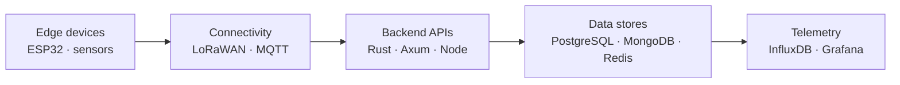

<div align="center">


<br><br>


&nbsp;
<a href="mailto:zroot1001@proton.me">

</a>
&nbsp;
<a href="https://github.com/Zoel-Manchon">

</a>

</div>

---

## root@zr00t

```bash
$ whoami

Zoel Arias Manchón
├── Backend & Web Developer
├── IoT & embedded tinkerer
├── Security enthusiast
└── Building real connected projects to learn
```

```text
What I'm into:
Embedded Devices → Backend APIs → Databases → Telemetry → Security
```

---

## Tech I Work With

<div align="center">

<table>
  <tr>
    <td align="center" width="92"><br>Rust</td>
    <td align="center" width="92"><br>Python</td>
    <td align="center" width="92"><br>TypeScript</td>
    <td align="center" width="92"><br>JavaScript</td>
    <td align="center" width="92"><br>PHP</td>
    <td align="center" width="92"><br>React</td>
    <td align="center" width="92"><br>Astro</td>
  </tr>
  <tr>
    <td align="center" width="92"><br>Node.js</td>
    <td align="center" width="92"><br>Laravel</td>
    <td align="center" width="92"><br>PostgreSQL</td>
    <td align="center" width="92"><br>MySQL</td>
    <td align="center" width="92"><br>MongoDB</td>
    <td align="center" width="92"><br>Redis</td>
    <td align="center" width="92"><br>Bootstrap</td>
  </tr>
  <tr>
    <td align="center" width="92"><br>Docker</td>
    <td align="center" width="92"><br>Nginx</td>
    <td align="center" width="92"><br>Linux</td>
    <td align="center" width="92"><br>Git</td>
    <td align="center" width="92"><br>Grafana</td>
    <td align="center" width="92"><br>InfluxDB</td>
    <td align="center" width="92"><br>Arduino</td>
  </tr>
</table>

</div>

---

## How My Projects Fit Together

Most of what I build is a slice of one bigger idea: getting data out of the physical world and into something I can store, watch, and secure. My projects line up along that path — sensors on one end, dashboards on the other.



---

## Projects

<table>
<tr>
<td width="50%" valign="top">

### Aegis — Zero-Trust Auth Lab & Attack Range

Ground-up zero-trust identity provider in Rust/Axum with a built-in Security Operations Console. JWT (RS256) with refresh rotation & replay (JTI) detection, mandatory TOTP MFA for admins, a per-request risk engine with GeoIP impossible-travel detection, RBAC, and a hash-chained (tamper-evident) audit trail. A React SOC console streams events live (SSE) with WebSocket alert popups and a geo-map, plus a built-in attack range (10 scenarios + storm) to launch attacks and watch the detections fire. Dockerized behind a Caddy single-origin proxy, with optional HashiCorp Vault dynamic DB credentials.


[**→ View repository**](https://github.com/Zoel-Manchon/aegis-zero-trust)

</td>
<td width="50%" valign="top">

### Auth-Lab — Zero-Trust Authentication

Zero-trust auth backend: JWT access/refresh with rotation & replay (JTI) protection, mandatory TOTP MFA for admins, a per-request risk engine with GeoIP impossible-travel detection, RBAC and a security-event audit trail. Fronted by an Astro SOC dashboard behind a Caddy TLS proxy, with a defensive attack simulator that CI-verifies the defenses. Optional HashiCorp Vault layer for secrets & dynamic DB credentials.


[**→ View repository**](https://github.com/Zoel-Manchon/auth-lab)

</td>
</tr>

<tr>
<td width="50%" valign="top">

### Crypto·Watch Dashboard

Real-time cryptocurrency terminal: a Rust/Axum backend streaming live prices over WebSockets to an Astro + React dashboard, with PostgreSQL persistence and a full Docker stack.


[**→ View repository**](https://github.com/Zoel-Manchon/crypto-dashboard)

</td>
<td width="50%" valign="top">

### API IoT

End-to-end IoT temperature & humidity monitor: ESP32 + DHT22 firmware publishing over MQTT to a Node.js/Express backend and a real-time React dashboard.


[**→ View repository**](https://github.com/Zoel-Manchon/api_iot)

</td>
</tr>

<tr>
<td width="50%" valign="top">

### Eastron LoRaWAN Energy Monitoring

Energy monitoring over LoRaWAN: collecting, processing, and visualizing electrical consumption data.


[**→ View repository**](https://github.com/Zoel-Manchon/eastron-lorawan-energy-monitoring)

</td>
<td width="50%" valign="top">

### SmartWatch LoRaWAN

Wearable IoT project using LoRaWAN, embedded sensors, and remote monitoring.


[**→ View repository**](https://github.com/Zoel-Manchon/Proyecto_IoT_J3_SmartWatch_LoRaWAN)

</td>
</tr>

<tr>
<td width="50%" valign="top">

### Arch Linux Hardened Server

Security-focused Arch Linux setup: system hardening, reduced attack surface, and production-ready configuration practices.


[**→ View repository**](https://github.com/Zoel-Manchon/arch-linux-hardened-server)

</td>
<td width="50%" valign="top">

### Snake HD

Modern Snake game built around game logic, rendering, and desktop interaction.


[**→ View repository**](https://github.com/Zoel-Manchon/snake-hd)

</td>
</tr>
</table>

---

## Currently Building

> Work in progress — repo and link will go live once it ships.

<table>
<tr>
<td width="50%" valign="top">

### Solar Weather Station — LoRa

Self-powered ESP32 weather station: BME280, BH1750, PMS5003 (PM1.0/2.5/10) and a rain sensor reporting over LoRa P2P to an ESP32 gateway, then MQTT → Home Assistant / Node-RED → InfluxDB → Grafana. Runs on an 18650 cell with a small solar panel.


</td>
<td width="50%" valign="top">
</td>
</tr>
</table>

---

## What I'm Learning Right Now

```rust
struct Developer {
    name: &'static str,
    focus: [&'static str; 4],
    currently_building: &'static str,
    coffee_dependency: bool,
}

let zoel = Developer {
    name: "Zoel Arias Manchón",
    focus: [
        "Rust & Axum for backend APIs",
        "IoT with ESP32 & LoRaWAN",
        "Linux & security fundamentals",
        "Databases & telemetry pipelines",
    ],
    currently_building: "connected systems, end to end",
    coffee_dependency: true,
};
```

## How I Like to Work

```text
Build small projects, not just isolated scripts.
Measure what I build.
Automate the boring stuff.
Keep security in mind from the start.
Ship something that actually works.
```

<div align="center">

### From embedded devices to web apps — still learning, still building.

</div>
